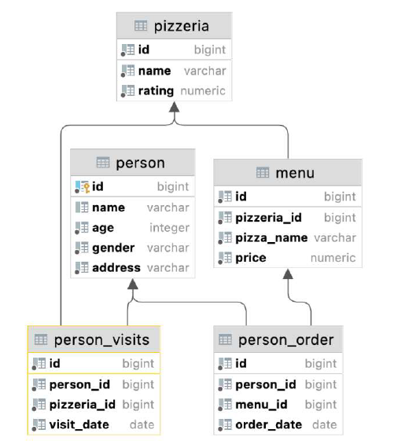

# Лабораторная работа No2
## Задача:
### 1. Адаптируйте pizza-скрипт для базы данных PostgreSQL. Если есть необходимость, то вы можете применить его заново, предварительно удалив таблицы командой.

#### Таблица `pizzeria` (Справочник пиццерий - ресторанов)
- поле `id` - первичный ключ
- поле `name` - имя пиццы
- поле `rating` - средний рейтинг ресторана (от 0 до 5 звезд)
#### Таблица `person` (Справочник людей кто любит пиццу)
- поле `id` - первичный ключ
- поле `name` - имя человека
- поле `age` - возраст
- поле `gender` - пол
- поле `address` - адрес проживания
#### Таблица `menu` (Справочник доступных меню с ценами и конкретными видами
пицц)
- поле `id` - первичный ключ
- поле `pizzeria_id` - ссылка на пиццерию
- поле `pizza_name` - название пиццы
- поле `price` - цена пиццы
#### Таблица `person_visits` (Операционная таблица с информацией о посещении
людей конкретных пиццерий)
- поле `id` - первичный ключ
- поле `person_id` - ссылка на посетившего человека
- поле `pizzeria_id` - ссылка на ресторан
- поле `visit_date` - дата (например 2022-01-01) визита
#### Таблица `person_order` (Операционная таблица с информацией о покупках пицц
людьми)
- поле `id` - первичный ключ
- поле `person_id` - ссылка на человека, который приобрел пиццу
- поле `menu_id` - ссылка на меню
- поле `order_date` - дата (например 2022-01-01) покупки
### 2. Необходимо написать SQL запросы к следующим 10 задачам ниже. Задание считается выполненным - если SQL запрос написан синтаксически корректно и возвращает ожидаемые данные на условие задачи.
- Напишите SQL запрос, который возвращает имя “любителя пиццы” и его возраст, проживающего в городе Казань. Результат отсортируйте по имени.
- Напишите SQL запрос, который выводит имена пиццерий с рейтингом, лежащим в диапазоне от 3.5 до 5 включительно. Результат отсортируйте по имени пиццерии в убывающем порядке
- Напишите SQL запрос, который использует формулу преобразования на основании персональной информации человека, которая дана ниже как пример. `Anna (age:16, gender: 'female', address:'Moscow')` Результат отсортируйте по значению вывода формулы.
- Выведите идентификаторы и имена пицц и людей в одном списке, отсортированном по имени.
- Выведите дату заказа и имя человека, сделавшего заказ, отсортированным по дате заказа и по имени человека одновременно.
- Выведите имя пиццерии, которая ни разу не была посещена.
- Напишите SQL запрос, который возвращает полный список всех имен людей, независимо посетили они пиццерию в интервал времени от 1 до 3 января 2022 года (включительно крайние дни) или нет. И также запрос должен возвращать полный список названий всех пиццерий, которые возможно были посещены в указанный интервал времени с указанием даты посещения. Все `NULL` значения в ответе преобразуйте в значение ‘-’ (символ тире). Результат отсортируйте по полям имя человека и название пиццерии. Пример части ответа вы можете найти ниже 
| person_name | visit_date | pizzeria_name |
| ----------- | ---------- | ------------- |
| - | - | DinoPizza |
| - | - | DoDo Pizza|
| Andrey | 2022-01-01 | Dominos |
| ... | ... | ... |
| Peter | 2022-01-03 | Pizza Hut |
- Добавьте новую пиццу в меню ресторана Dominos с названием “greek pizza” и ценой 800 рублей.
- Обновите цену для пиццы “greek pizza” для ресторана Dominos с учетом 10 % скидки.
- Выведите имена всех посетителей, количество посещений в рестораны которых должно быть ровно 3. Результат отсортируйте по имени посетителя.

## Создаем подключение к БД


```python
import psycopg2
from tabulate import tabulate

### Подключение к PostgreSQL
connection = psycopg2.connect(
    host="localhost",
    port="5432",
    database="",
    user="",
    password="",
)
### Создание курсора
cursor = connection.cursor()

print("Подключение к PostgreSQL успешно.")
```

    Подключение к PostgreSQL успешно.
    

## Создание схемы
### !Отключено, для данной работы схема создается в скрипте pizza_model.sql


```python
#cursor.execute("CREATE SCHEMA IF NOT EXISTS ivan_patakin;")
#connection.commit()

#print("Схема 'ivan_patakin' создана.")
```

## Выполняем pizza-скрипт для создания таблиц

pizza_model был немного изменен
1. Добавлено создание схемы, если она не создана.
2. Добавлен автоинкремент ко всем таблицам и восстановлена последовательность в соответствии с данными уже находящимися в таблице

```python
with open('../Data/Lab2/pizza_model.sql', 'r', encoding='utf-8') as file:
    sql_script = file.read()

cursor.execute(sql_script)

connection.commit()

print("pizza-скрипт выполнен")
```

    pizza-скрипт выполнен
    

## SQL запросы:

### SQL запрос, который возвращает имя “любителя пиццы” и его возраст, проживающего в городе Казань. Результат отсортируйте по имени.


```python
cursor.execute("""
    SELECT 
        p.name AS person_name, 
        p.age, 
        COUNT(po.id) AS pizza_orders_count
    FROM 
        ivan_patakin.person p
    LEFT JOIN 
        ivan_patakin.person_order po 
    ON 
        p.id = po.person_id
    WHERE 
        p.address = 'Kazan'
    GROUP BY 
        p.id
    ORDER BY 
        p.name;
""")

rows = cursor.fetchall()
headers = ["Имя", "Возраст", "Количество"]
print(tabulate(rows, headers=headers))

```

    Имя       Возраст    Количество
    ------  ---------  ------------
    Denis          13             5
    Elvira         45             2
    Kate           33             1
    

### SQL запрос, который выводит имена пиццерий с рейтингом, лежащим в диапазоне от 3.5 до 5 включительно. Результат отсортируйте по имени пиццерии в убывающем порядке.


```python
cursor.execute("""
    SELECT 
        name AS pizzeria_name, 
        rating
    FROM 
        ivan_patakin.pizzeria
    WHERE 
        rating BETWEEN 3.5 AND 5
    ORDER BY 
        name DESC;
""")

rows = cursor.fetchall()
headers = ["Пиццерия", "Рейтинг"]
print(tabulate(rows, headers=headers))
```

    Пиццерия      Рейтинг
    ----------  ---------
    Pizza Hut         4.6
    Papa Johns        4.9
    Dominos           4.3
    DinoPizza         4.2
    

### SQL запрос, который использует формулу преобразования на основании персональной информации человека, которая дана ниже как пример. `Anna (age:16, gender: 'female', address:'Moscow')` Результат отсортируйте по значению вывода формулы.


```python
cursor.execute("""
    SELECT CONCAT(name, ' (age:', age, ', gender: ''', gender, ''', address:''', address, ''')') AS person_info
    FROM ivan_patakin.person
    ORDER BY person_info;
""")

rows = cursor.fetchall()
for row in rows:
    print(row[0])
```

    Andrey (age:21, gender: 'male', address:'Moscow')
    Anna (age:16, gender: 'female', address:'Moscow')
    Denis (age:13, gender: 'male', address:'Kazan')
    Dmitriy (age:18, gender: 'male', address:'Samara')
    Elvira (age:45, gender: 'female', address:'Kazan')
    Irina (age:21, gender: 'female', address:'Saint-Petersburg')
    Kate (age:33, gender: 'female', address:'Kazan')
    Nataly (age:30, gender: 'female', address:'Novosibirsk')
    Peter (age:24, gender: 'male', address:'Saint-Petersburg')
    

### Выведите идентификаторы и имена пицц и людей в одном списке, отсортированном по имени.


```python
cursor.execute("""
    SELECT id, name
    FROM ivan_patakin.person
    UNION ALL
    SELECT id, pizza_name AS name
    FROM ivan_patakin.menu
    ORDER BY name;
""")

rows = cursor.fetchall()
headers = ["id", "name"]
print(tabulate(rows, headers=headers))
```

      id  name
    ----  ---------------
       2  Andrey
       1  Anna
       4  Denis
       9  Dmitriy
       5  Elvira
       6  Irina
       3  Kate
       8  Nataly
       7  Peter
       5  cheese pizza
       1  cheese pizza
       8  cheese pizza
      10  cheese pizza
      12  cheese pizza
      16  cheese pizza
       9  mushroom pizza
      13  mushroom pizza
       6  pepperoni pizza
      17  pepperoni pizza
      14  pepperoni pizza
       2  pepperoni pizza
      15  sausage pizza
       7  sausage pizza
       3  sausage pizza
      18  supreme pizza
      11  supreme pizza
       4  supreme pizza
    

### Выведите дату заказа и имя человека, сделавшего заказ, отсортированным по дате заказа и по имени человека одновременно.


```python
cursor.execute("""
    SELECT po.order_date, p.name AS person_name
    FROM ivan_patakin.person_order po
    JOIN ivan_patakin.person p ON po.person_id = p.id
    ORDER BY po.order_date, p.name;
""")

rows = cursor.fetchall()
headers = ["Дата", "Имя"]
print(tabulate(rows, headers=headers))
```

    Дата        Имя
    ----------  -------
    2022-01-01  Andrey
    2022-01-01  Andrey
    2022-01-01  Anna
    2022-01-01  Anna
    2022-01-01  Irina
    2022-01-03  Peter
    2022-01-04  Kate
    2022-01-05  Peter
    2022-01-05  Peter
    2022-01-06  Nataly
    2022-01-07  Denis
    2022-01-07  Denis
    2022-01-07  Denis
    2022-01-07  Nataly
    2022-01-08  Denis
    2022-01-08  Denis
    2022-01-09  Dmitriy
    2022-01-09  Elvira
    2022-01-09  Elvira
    2022-01-10  Dmitriy
    

### Выведите имя пиццерии, которая ни разу не была посещена.


```python
cursor.execute("""
    SELECT p.name AS pizzeria_name
    FROM ivan_patakin.pizzeria p
    LEFT JOIN ivan_patakin.person_visits pv ON p.id = pv.pizzeria_id
    WHERE pv.id IS NULL;
""")

rows = cursor.fetchall()
for row in rows:
    print(row[0])
```

    DoDo Pizza
    

### SQL запрос, который возвращает полный список всех имен людей, независимо посетили они пиццерию в интервал времени от 1 до 3 января 2022 года (включительно крайние дни) или нет. И также запрос должен возвращать полный список названий всех пиццерий, которые возможно были посещены в указанный интервал времени с указанием даты посещения. Все `NULL` значения в ответе преобразуйте в значение ‘-’ (символ тире). Результат отсортируйте по полям имя человека и название пиццерии.


```python
cursor.execute("""
    WITH valid_visits AS (
        SELECT
            person_id,
            pizzeria_id,
            visit_date
        FROM
            ivan_patakin.person_visits
        WHERE
            visit_date BETWEEN '2022-01-01' AND '2022-01-03'
    )
    SELECT
        COALESCE(p.name, '-') AS person_name,
        COALESCE(TO_CHAR(vv.visit_date, 'YYYY-MM-DD'), '-') AS visit_date,
        COALESCE(pr.name, '-') AS pizzeria_name
    FROM
        ivan_patakin.person p
    FULL OUTER JOIN valid_visits vv ON p.id = vv.person_id
    FULL OUTER JOIN ivan_patakin.pizzeria pr ON vv.pizzeria_id = pr.id
    ORDER BY
        person_name,
        pizzeria_name;
""")

rows = cursor.fetchall()
headers = ["Имя", "Дата", "Пиццерия"]
print(tabulate(rows, headers=headers))
```

    Имя      Дата        Пиццерия
    -------  ----------  ----------
    -        -           DinoPizza
    -        -           DoDo Pizza
    Andrey   2022-01-01  Dominos
    Andrey   2022-01-02  Pizza Hut
    Anna     2022-01-01  Pizza Hut
    Denis    -           -
    Dmitriy  -           -
    Elvira   -           -
    Irina    2022-01-01  Papa Johns
    Kate     2022-01-03  Best Pizza
    Nataly   -           -
    Peter    2022-01-03  Pizza Hut
    

### Добавьте новую пиццу в меню ресторана Dominos с названием “greek pizza” и ценой 800 рублей.


```python
cursor.execute("""
    INSERT INTO ivan_patakin.menu (pizzeria_id, pizza_name, price)
    SELECT
        p.id AS pizzeria_id,
        'greek pizza' AS pizza_name,
        800 AS price
    FROM
        ivan_patakin.pizzeria p
    WHERE
        p.name = 'Dominos';
""")

connection.commit()
print("Пицца greek pizza добавлена в ресторан Dominos")

cursor.execute("""
    SELECT 
        m.id AS menu_id,
        p.name AS pizzeria_name,
        m.pizza_name,
        m.price
    FROM ivan_patakin.menu m
    JOIN ivan_patakin.pizzeria p ON m.pizzeria_id = p.id
    WHERE m.pizza_name = 'greek pizza';
""")

rows = cursor.fetchall()
headers = ["id", "Пиццерия", "Название пиццы", "Цена"]
print(tabulate(rows, headers=headers))

```

    Пицца greek pizza добавлена в ресторан Dominos
      id  Пиццерия    Название пиццы      Цена
    ----  ----------  ----------------  ------
      19  Dominos     greek pizza          800
    

### Обновите цену для пиццы “greek pizza” для ресторана Dominos с учетом 10 % скидки.


```python
cursor.execute("""
    UPDATE ivan_patakin.menu
    SET price = price * 0.9
    WHERE pizza_name = 'greek pizza' AND pizzeria_id = (SELECT id FROM ivan_patakin.pizzeria WHERE name = 'Dominos');
""")

connection.commit()

print("Цена для greek pizza обновлена")

cursor.execute("""
    SELECT 
        m.pizza_name, 
        p.name AS pizzeria_name, 
        m.price
    FROM ivan_patakin.menu m
    JOIN ivan_patakin.pizzeria p ON m.pizzeria_id = p.id
    WHERE m.pizza_name = 'greek pizza' AND p.name = 'Dominos';
""")

rows = cursor.fetchall()
headers = ["Название пиццы", "Пиццерия", "Цена"]
print(tabulate(rows, headers=headers))
```

    Цена для greek pizza обновлена
    Название пиццы    Пиццерия      Цена
    ----------------  ----------  ------
    greek pizza       Dominos        720
    

### Выведите имена всех посетителей, количество посещений в рестораны которых должно быть ровно 3. Результат отсортируйте по имени посетителя.


```python
cursor.execute("""
    SELECT 
        p.name AS person_name,
        COUNT(pv.id) AS visit_count
    FROM 
        ivan_patakin.person p
    JOIN 
        ivan_patakin.person_visits pv 
    ON 
        p.id = pv.person_id
    GROUP BY 
        p.name
    HAVING 
        COUNT(pv.id) = 3
    ORDER BY 
        p.name;
""")

rows = cursor.fetchall()
headers = ["Имя", "Количество посещений"]
print(tabulate(rows, headers=headers))
```

    Имя        Количество посещений
    -------  ----------------------
    Dmitriy                       3
    Nataly                        3
    

## Удаление таблиц


```python
cursor.execute("""
    DROP TABLE IF EXISTS ivan_patakin.person_order;
    DROP TABLE IF EXISTS ivan_patakin.menu;
    DROP TABLE IF EXISTS ivan_patakin.person_visits;
    DROP TABLE IF EXISTS ivan_patakin.pizzeria;
    DROP TABLE IF EXISTS ivan_patakin.person;
""")

connection.commit()

print("Таблицы удалены")
```

    Таблицы удалены
    


```python
### Закрытие курсора и соединения
cursor.close()
connection.close()

print("Соединение с PostgreSQL закрыто.")
```

    Соединение с PostgreSQL закрыто.
    
