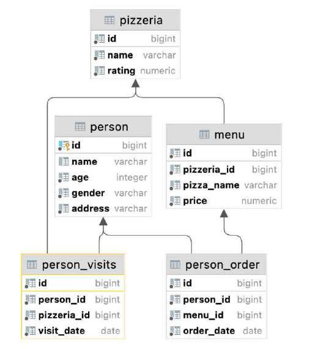
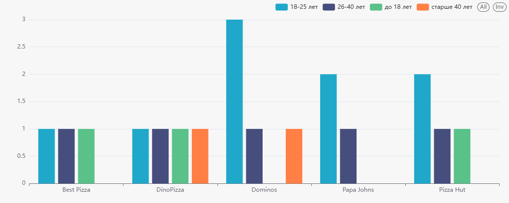
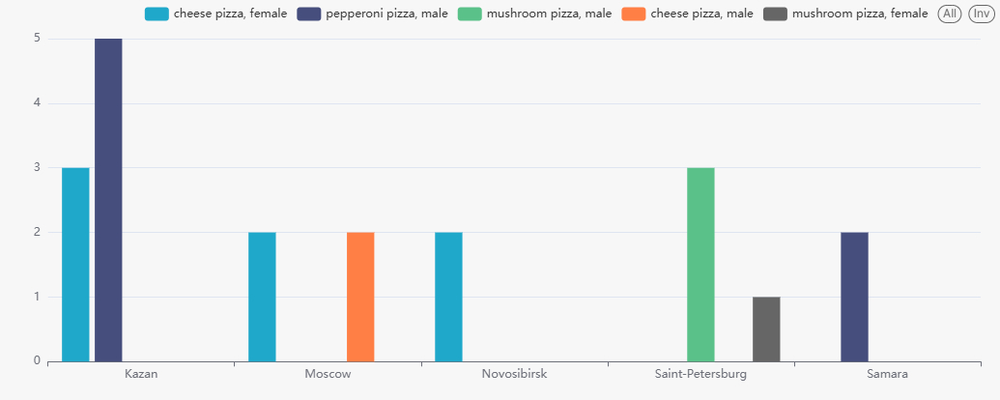
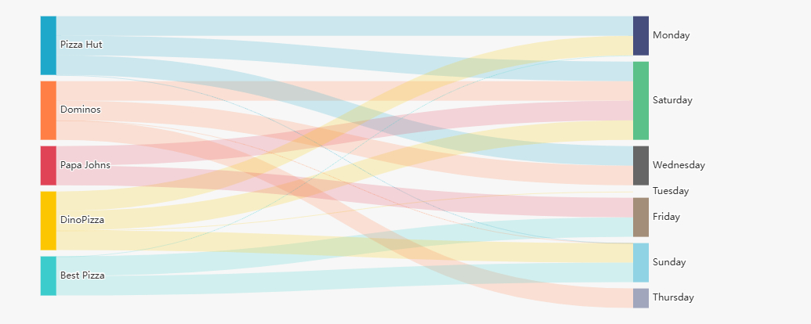
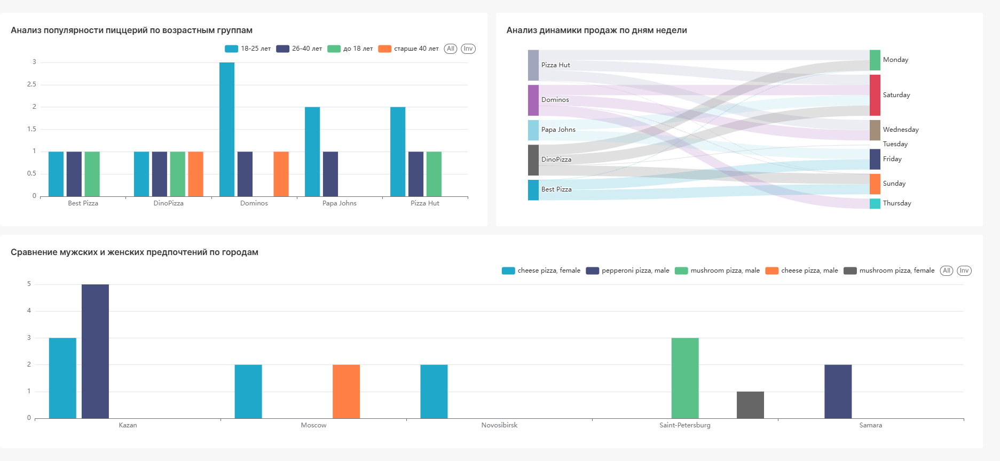

# Лабораторная работа No5
## Задача:
### 1. Адаптируйте pizza-скрипт для базы данных PostgreSQL.
Скрип аналогичен скрипту из лабораторной работы No2.
Если есть необходимость, то вы можете применить его заново, предварительно удалив таблицы командой.  

#### Таблица `pizzeria` (Справочник пиццерий - ресторанов)
- поле `id` - первичный ключ
- поле `name` - имя пиццы
- поле `rating` - средний рейтинг ресторана (от 0 до 5 звезд)
#### Таблица `person` (Справочник людей кто любит пиццу)
- поле `id` - первичный ключ
- поле `name` - имя человека
- поле `age` - возраст
- поле `gender` - пол
- поле `address` - адрес проживания
#### Таблица `menu` (Справочник доступных меню с ценами и конкретными видами
пицц)
- поле `id` - первичный ключ
- поле `pizzeria_id` - ссылка на пиццерию
- поле `pizza_name` - название пиццы
- поле `price` - цена пиццы
#### Таблица `person_visits` (Операционная таблица с информацией о посещении
людей конкретных пиццерий)
- поле `id` - первичный ключ
- поле `person_id` - ссылка на посетившего человека
- поле `pizzeria_id` - ссылка на ресторан
- поле `visit_date` - дата (например 2022-01-01) визита
#### Таблица `person_order` (Операционная таблица с информацией о покупках пицц
людьми)
- поле `id` - первичный ключ
- поле `person_id` - ссылка на человека, который приобрел пиццу
- поле `menu_id` - ссылка на меню
- поле `order_date` - дата (например 2022-01-01) покупки

### 2. Необходимо создать 1 BI дашборд в Superset с 3 графиками на основании 3 SQL запросов.
Задание считается выполненным - если SQL запрос написан синтаксически корректно и возвращает ожидаемые данные на условие задачи.

Superset - https://superset.apache.org/docs/quickstart/

Какой вид / тип визуализации вы будет использовать - решать Вам самим!
- Анализ популярности пиццерий по возрастным группам
    
    Определите, какие пиццерии наиболее популярны среди разных возрастных групп. Разделите людей на возрастные группы: до 18 лет, 18-25 лет, 26-40 лет и старше 40. Для каждой группы и пиццерии выведите:
    - возрастную группу
    - название пиццерии
    - количество посещений
    - средний рейтинг пиццерии
    - общую сумму потраченных денег в этой пиццерии

    Отсортируйте по возрастной группе и убыванию количества посещений.

- Сравнение мужских и женских предпочтений по городам

    Проанализируйте различия в предпочтениях между мужчинами и женщинами в разных городах. Выведите:
    - город
    - пол
    - самое популярное название пиццы (по количеству заказов)
    - среднюю стоимость заказа
    - количество уникальных посетителей пиццерий
    - долю заказов этого пола от общего числа заказов в городе (в процентах)
    
    Отсортируйте по городу и полу.

- Анализ динамики продаж по дням недели
    Исследуйте, как день недели влияет на активность посещений пиццерий. Выведите:
    - название пиццерии
    - день недели (понедельник, вторник и т.д.)
    - количество посещений
    - количество сделанных заказов
    - средний чек (общая сумма / количество заказов)
    - разницу в среднем чеке по сравнению со средним чеком всей пиццерии (в процентах)

  Отсортируйте по названию пиццерии и дню недели (от понедельника до воскресенья).

## Создаем подключение к БД


```python
import psycopg2
from tabulate import tabulate

### Подключение к PostgreSQL
connection = psycopg2.connect(
    host="localhost",
    port="5432",
    database="",
    user="",
    password="",
)
### Создание курсора
cursor = connection.cursor()

print("Подключение к PostgreSQL успешно.")
```

    Подключение к PostgreSQL успешно.
    

## Создание схемы
### !Отключено, для данной работы схема создается в скрипте pizza_model.sql


```python
#cursor.execute("CREATE SCHEMA IF NOT EXISTS ivan_patakin;")
#connection.commit()

#print("Схема 'ivan_patakin' создана.")
```

## Выполняем pizza-скрипт для создания таблиц

pizza_model был немного изменен в lab_2:
1. Добавлено создание схемы, если она не создана.
2. Добавлен автоинкремент ко всем таблицам и восстановлена последовательность в соответствии с данными уже находящимися в таблице

```python
with open('../Data/Lab2/pizza_model.sql', 'r', encoding='utf-8') as file:
    sql_script = file.read()

cursor.execute(sql_script)

connection.commit()

print("pizza-скрипт выполнен")
```

    pizza-скрипт выполнен
    

## SQL запросы:

### Анализ популярности пиццерий по возрастным группам


```python
cursor.execute("""
CREATE VIEW ivan_patakin.popularity_by_age_group AS
WITH age_groups AS (
    SELECT
        p.id AS person_id,
        CASE
            WHEN p.age < 18 THEN 'до 18 лет'
            WHEN p.age BETWEEN 18 AND 25 THEN '18-25 лет'
            WHEN p.age BETWEEN 26 AND 40 THEN '26-40 лет'
            ELSE 'старше 40 лет'
        END AS age_group
    FROM ivan_patakin.person p
),
visits_summary AS (
    SELECT
        ag.age_group,
        pv.pizzeria_id,
        COUNT(*) AS visit_count
    FROM ivan_patakin.person_visits pv
    JOIN age_groups ag ON pv.person_id = ag.person_id
    GROUP BY ag.age_group, pv.pizzeria_id
),
spending_summary AS (
    SELECT
        ag.age_group,
        m.pizzeria_id,
        SUM(m.price) AS total_spent
    FROM ivan_patakin.person_order po
    JOIN ivan_patakin.menu m ON po.menu_id = m.id
    JOIN age_groups ag ON po.person_id = ag.person_id
    GROUP BY ag.age_group, m.pizzeria_id
)
SELECT
    vs.age_group,
    pz.name AS pizzeria_name,
    vs.visit_count,
    pz.rating AS average_rating,
    COALESCE(ss.total_spent, 0) AS total_spent
FROM visits_summary vs
JOIN ivan_patakin.pizzeria pz ON vs.pizzeria_id = pz.id
LEFT JOIN spending_summary ss ON vs.age_group = ss.age_group AND vs.pizzeria_id = ss.pizzeria_id
ORDER BY
    vs.age_group,
    vs.visit_count DESC;
""")

connection.commit()

print("Представление для популярности пиццерий по возрастным группам создано")

```

    Представление для популярности пиццерий по возрастным группам создано
    


```python
cursor.execute("""
SELECT 
    age_group AS "Возрастная группа",
    pizzeria_name AS "Название пиццерии",
    visit_count AS "Количество посещений",
    average_rating AS "Средний рейтинг",
    total_spent AS "Общая сумма потраченных денег"
FROM ivan_patakin.popularity_by_age_group;
""")

rows = cursor.fetchall()

print("Популярность пиццерий по возрастным группам:")
headers = ["Возрастная группа", "Название пиццерии", "Количество посещений", "Средний рейтинг", "Общая сумма потраченных денег"]
print(tabulate(rows, headers=headers, tablefmt="grid"))
```

    Популярность пиццерий по возрастным группам:
    +---------------------+---------------------+------------------------+-------------------+---------------------------------+
    | Возрастная группа   | Название пиццерии   |   Количество посещений |   Средний рейтинг |   Общая сумма потраченных денег |
    +=====================+=====================+========================+===================+=================================+
    | 18-25 лет           | Dominos             |                      3 |               4.3 |                            3000 |
    +---------------------+---------------------+------------------------+-------------------+---------------------------------+
    | 18-25 лет           | Pizza Hut           |                      2 |               4.6 |                            2400 |
    +---------------------+---------------------+------------------------+-------------------+---------------------------------+
    | 18-25 лет           | Papa Johns          |                      2 |               4.9 |                             950 |
    +---------------------+---------------------+------------------------+-------------------+---------------------------------+
    | 18-25 лет           | Best Pizza          |                      1 |               2.3 |                             850 |
    +---------------------+---------------------+------------------------+-------------------+---------------------------------+
    | 18-25 лет           | DinoPizza           |                      1 |               4.2 |                             800 |
    +---------------------+---------------------+------------------------+-------------------+---------------------------------+
    | 26-40 лет           | Pizza Hut           |                      1 |               4.6 |                               0 |
    +---------------------+---------------------+------------------------+-------------------+---------------------------------+
    | 26-40 лет           | Best Pizza          |                      1 |               2.3 |                             700 |
    +---------------------+---------------------+------------------------+-------------------+---------------------------------+
    | 26-40 лет           | Dominos             |                      1 |               4.3 |                             800 |
    +---------------------+---------------------+------------------------+-------------------+---------------------------------+
    | 26-40 лет           | Papa Johns          |                      1 |               4.9 |                            1000 |
    +---------------------+---------------------+------------------------+-------------------+---------------------------------+
    | 26-40 лет           | DinoPizza           |                      1 |               4.2 |                               0 |
    +---------------------+---------------------+------------------------+-------------------+---------------------------------+
    | до 18 лет           | Best Pizza          |                      1 |               2.3 |                            2350 |
    +---------------------+---------------------+------------------------+-------------------+---------------------------------+
    | до 18 лет           | DinoPizza           |                      1 |               4.2 |                            1800 |
    +---------------------+---------------------+------------------------+-------------------+---------------------------------+
    | до 18 лет           | Pizza Hut           |                      1 |               4.6 |                            2100 |
    +---------------------+---------------------+------------------------+-------------------+---------------------------------+
    | старше 40 лет       | DinoPizza           |                      1 |               4.2 |                            1800 |
    +---------------------+---------------------+------------------------+-------------------+---------------------------------+
    | старше 40 лет       | Dominos             |                      1 |               4.3 |                               0 |
    +---------------------+---------------------+------------------------+-------------------+---------------------------------+
    



### Сравнение мужских и женских предпочтений по городам


```python
cursor.execute("""
CREATE VIEW ivan_patakin.gender_preferences_by_city AS
WITH orders_summary AS (
    SELECT
        p.address AS city,
        p.gender,
        COUNT(*) AS total_orders,
        ROUND(AVG(m.price), 2) AS avg_order_price,
        COUNT(DISTINCT p.id) AS unique_visitors
    FROM ivan_patakin.person_order po
    JOIN ivan_patakin.person p ON po.person_id = p.id
    JOIN ivan_patakin.menu m ON po.menu_id = m.id
    GROUP BY p.address, p.gender
),
pizza_popularity AS (
    SELECT
        p.address AS city,
        p.gender,
        m.pizza_name,
        COUNT(*) AS pizza_count,
        ROW_NUMBER() OVER (PARTITION BY p.address, p.gender ORDER BY COUNT(*) DESC, m.pizza_name) AS rank
    FROM ivan_patakin.person_order po
    JOIN ivan_patakin.person p ON po.person_id = p.id
    JOIN ivan_patakin.menu m ON po.menu_id = m.id
    GROUP BY p.address, p.gender, m.pizza_name
),
city_orders AS (
    SELECT
        p.address AS city,
        COUNT(*) AS total_city_orders
    FROM ivan_patakin.person_order po
    JOIN ivan_patakin.person p ON po.person_id = p.id
    GROUP BY p.address
)
SELECT
    os.city,
    os.gender,
    pp.pizza_name AS most_popular_pizza,
    os.total_orders,
    os.avg_order_price,
    os.unique_visitors,
    ROUND((os.total_orders::NUMERIC / co.total_city_orders) * 100, 2) AS order_share_percentage
FROM orders_summary os
JOIN pizza_popularity pp ON os.city = pp.city AND os.gender = pp.gender AND pp.rank = 1
JOIN city_orders co ON os.city = co.city
ORDER BY os.city, os.gender;
""")

connection.commit()

print("Представление для мужских и женских предпочтений по городам создано")
```

    Представление для мужских и женских предпочтений по городам создано
    


```python
cursor.execute("""
SELECT 
    city AS "Город",
    gender AS "Пол",
    most_popular_pizza AS "Самая популярная пицца",
    total_orders AS "Общее количество заказов",
    avg_order_price AS "Средняя стоимость заказа",
    unique_visitors AS "Количество уникальных посетителей",
    order_share_percentage AS "Доля заказов (%)"
FROM ivan_patakin.gender_preferences_by_city;
""")

rows = cursor.fetchall()

print("Сравнение мужских и женских предпочтений по городам:")
headers = ["Город", "Пол", "Самая популярная пицца", "Общее количество заказов", "Средняя стоимость заказа", "Количество уникальных посетителей", "Доля заказов (%)"]
print(tabulate(rows, headers=headers, tablefmt="grid"))
```

    Сравнение мужских и женских предпочтений по городам:
    +------------------+--------+--------------------------+----------------------------+----------------------------+-------------------------------------+--------------------+
    | Город            | Пол    | Самая популярная пицца   |   Общее количество заказов |   Средняя стоимость заказа |   Количество уникальных посетителей |   Доля заказов (%) |
    +==================+========+==========================+============================+============================+=====================================+====================+
    | Kazan            | female | cheese pizza             |                          3 |                     833.33 |                                   2 |               37.5 |
    +------------------+--------+--------------------------+----------------------------+----------------------------+-------------------------------------+--------------------+
    | Kazan            | male   | pepperoni pizza          |                          5 |                     830    |                                   1 |               62.5 |
    +------------------+--------+--------------------------+----------------------------+----------------------------+-------------------------------------+--------------------+
    | Moscow           | female | cheese pizza             |                          2 |                    1050    |                                   1 |               50   |
    +------------------+--------+--------------------------+----------------------------+----------------------------+-------------------------------------+--------------------+
    | Moscow           | male   | cheese pizza             |                          2 |                     950    |                                   1 |               50   |
    +------------------+--------+--------------------------+----------------------------+----------------------------+-------------------------------------+--------------------+
    | Novosibirsk      | female | cheese pizza             |                          2 |                     900    |                                   1 |              100   |
    +------------------+--------+--------------------------+----------------------------+----------------------------+-------------------------------------+--------------------+
    | Saint-Petersburg | female | mushroom pizza           |                          1 |                     950    |                                   1 |               25   |
    +------------------+--------+--------------------------+----------------------------+----------------------------+-------------------------------------+--------------------+
    | Saint-Petersburg | male   | mushroom pizza           |                          3 |                    1166.67 |                                   1 |               75   |
    +------------------+--------+--------------------------+----------------------------+----------------------------+-------------------------------------+--------------------+
    | Samara           | male   | pepperoni pizza          |                          2 |                     825    |                                   1 |              100   |
    +------------------+--------+--------------------------+----------------------------+----------------------------+-------------------------------------+--------------------+
    



### Анализ динамики продаж по дням недели


```python
cursor.execute("""
CREATE VIEW ivan_patakin.sales_dynamics_by_weekday AS
WITH visits_by_weekday AS (
    SELECT
        pz.name AS pizzeria_name,
        TRIM(TO_CHAR(pv.visit_date, 'Day')) AS weekday,
        COUNT(*) AS visit_count
    FROM ivan_patakin.person_visits pv
    JOIN ivan_patakin.pizzeria pz ON pv.pizzeria_id = pz.id
    GROUP BY pz.name, TRIM(TO_CHAR(pv.visit_date, 'Day'))
),
orders_by_weekday AS (
    SELECT
        pz.name AS pizzeria_name,
        TRIM(TO_CHAR(po.order_date, 'Day')) AS weekday,
        COUNT(*) AS order_count,
        SUM(m.price) AS total_revenue,
        ROUND(AVG(m.price), 2) AS avg_check
    FROM ivan_patakin.person_order po
    JOIN ivan_patakin.menu m ON po.menu_id = m.id
    JOIN ivan_patakin.pizzeria pz ON m.pizzeria_id = pz.id
    GROUP BY pz.name, TRIM(TO_CHAR(po.order_date, 'Day'))
),
avg_check_by_pizzeria AS (
    SELECT
        pz.name AS pizzeria_name,
        ROUND(AVG(m.price), 2) AS overall_avg_check
    FROM ivan_patakin.menu m
    JOIN ivan_patakin.pizzeria pz ON m.pizzeria_id = pz.id
    GROUP BY pz.name
)
SELECT
    vbw.pizzeria_name,
    vbw.weekday,
    vbw.visit_count,
    obw.order_count,
    obw.avg_check,
    ROUND(((obw.avg_check - acbp.overall_avg_check) / acbp.overall_avg_check) * 100, 2) AS avg_check_difference_percentage
FROM visits_by_weekday vbw
LEFT JOIN orders_by_weekday obw ON vbw.pizzeria_name = obw.pizzeria_name AND vbw.weekday = obw.weekday
JOIN avg_check_by_pizzeria acbp ON vbw.pizzeria_name = acbp.pizzeria_name
ORDER BY vbw.pizzeria_name, 
         CASE 
             WHEN vbw.weekday = 'Monday' THEN 1
             WHEN vbw.weekday = 'Tuesday' THEN 2
             WHEN vbw.weekday = 'Wednesday' THEN 3
             WHEN vbw.weekday = 'Thursday' THEN 4
             WHEN vbw.weekday = 'Friday' THEN 5
             WHEN vbw.weekday = 'Saturday' THEN 6
             WHEN vbw.weekday = 'Sunday' THEN 7
         END;
""")

connection.commit()
print("Представление для динамики продаж по дням недели создано")
```

    Представление для динамики продаж по дням недели создано
    


```python
cursor.execute("""
SELECT 
    pizzeria_name AS "Название пиццерии",
    weekday AS "День недели",
    visit_count AS "Количество посещений",
    order_count AS "Количество заказов",
    avg_check AS "Средний чек",
    avg_check_difference_percentage AS "Разница в среднем чеке (%)"
FROM ivan_patakin.sales_dynamics_by_weekday;
""")

rows = cursor.fetchall()

print("Динамика продаж по дням недели:")
headers = ["Название пиццерии", "День недели", "Количество посещений", "Количество заказов", "Средний чек", "Разница в среднем чеке (%)"]
print(tabulate(rows, headers=headers, tablefmt="grid"))
```

    Динамика продаж по дням недели:
    +---------------------+---------------+------------------------+----------------------+---------------+------------------------------+
    | Название пиццерии   | День недели   |   Количество посещений |   Количество заказов |   Средний чек |   Разница в среднем чеке (%) |
    +=====================+===============+========================+======================+===============+==============================+
    | Best Pizza          | Monday        |                      1 |                      |               |                              |
    +---------------------+---------------+------------------------+----------------------+---------------+------------------------------+
    | Best Pizza          | Friday        |                      1 |                    3 |        783.33 |                         0    |
    +---------------------+---------------+------------------------+----------------------+---------------+------------------------------+
    | Best Pizza          | Sunday        |                      1 |                    1 |        850    |                         8.51 |
    +---------------------+---------------+------------------------+----------------------+---------------+------------------------------+
    | DinoPizza           | Monday        |                      1 |                    1 |        800    |                       -12.73 |
    +---------------------+---------------+------------------------+----------------------+---------------+------------------------------+
    | DinoPizza           | Tuesday       |                      1 |                      |               |                              |
    +---------------------+---------------+------------------------+----------------------+---------------+------------------------------+
    | DinoPizza           | Saturday      |                      1 |                    2 |        900    |                        -1.82 |
    +---------------------+---------------+------------------------+----------------------+---------------+------------------------------+
    | DinoPizza           | Sunday        |                      1 |                    2 |        900    |                        -1.82 |
    +---------------------+---------------+------------------------+----------------------+---------------+------------------------------+
    | Dominos             | Wednesday     |                      1 |                    1 |       1100    |                        15.79 |
    +---------------------+---------------+------------------------+----------------------+---------------+------------------------------+
    | Dominos             | Thursday      |                      1 |                    1 |        800    |                       -15.79 |
    +---------------------+---------------+------------------------+----------------------+---------------+------------------------------+
    | Dominos             | Saturday      |                      2 |                    2 |        950    |                         0    |
    +---------------------+---------------+------------------------+----------------------+---------------+------------------------------+
    | Dominos             | Sunday        |                      1 |                      |               |                              |
    +---------------------+---------------+------------------------+----------------------+---------------+------------------------------+
    | Papa Johns          | Friday        |                      1 |                    1 |       1000    |                        11.11 |
    +---------------------+---------------+------------------------+----------------------+---------------+------------------------------+
    | Papa Johns          | Saturday      |                      2 |                    1 |        950    |                         5.56 |
    +---------------------+---------------+------------------------+----------------------+---------------+------------------------------+
    | Pizza Hut           | Monday        |                      1 |                    1 |       1200    |                         6.67 |
    +---------------------+---------------+------------------------+----------------------+---------------+------------------------------+
    | Pizza Hut           | Wednesday     |                      1 |                    1 |       1200    |                         6.67 |
    +---------------------+---------------+------------------------+----------------------+---------------+------------------------------+
    | Pizza Hut           | Saturday      |                      1 |                    2 |       1050    |                        -6.67 |
    +---------------------+---------------+------------------------+----------------------+---------------+------------------------------+
    | Pizza Hut           | Sunday        |                      1 |                      |               |                              |
    +---------------------+---------------+------------------------+----------------------+---------------+------------------------------+
    



## Дашборд


## Удаление таблиц


```python
cursor.execute("""
    DROP VIEW IF EXISTS ivan_patakin.popularity_by_age_group;
    DROP VIEW IF EXISTS ivan_patakin.gender_preferences_by_city;
    DROP VIEW IF EXISTS ivan_patakin.sales_dynamics_by_weekday;
    DROP TABLE IF EXISTS ivan_patakin.person_order;
    DROP TABLE IF EXISTS ivan_patakin.menu;
    DROP TABLE IF EXISTS ivan_patakin.person_visits;
    DROP TABLE IF EXISTS ivan_patakin.pizzeria;
    DROP TABLE IF EXISTS ivan_patakin.person;
""")

connection.commit()

print("Таблицы удалены")
```

    Таблицы удалены
    


```python
cursor.close()
connection.close()

print("Соединение с PostgreSQL закрыто.")
```

    Соединение с PostgreSQL закрыто.
    
